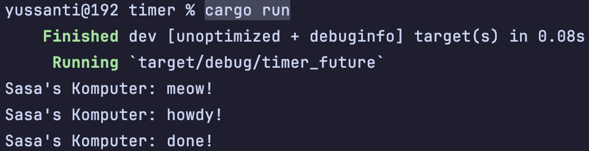

# reflection 👻

**1.2 Understanding How it Works <br>**

Dari percobaan ini dapat dilihat bahwa Sasa's Komputer: meow! muncul lebih dulu dari howdy dan done.
Hal ini bisa terjadi karena main() langsung mengeksekusi
perintah ``` println!("Sasa's Komputer: meow!")``` bersamaan dengan kode di bagian ```spawner.spawn(...```, jadinya
yang meow langsung keprint, tetapi yang howdy dan done itu nunggu delay 2 detik dulu (karena pakai timer future).