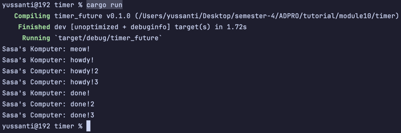
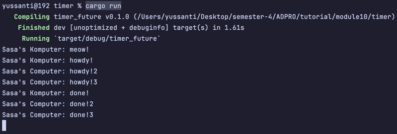
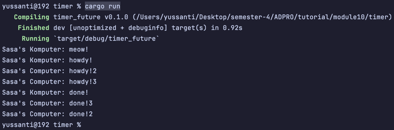

# reflection 👻

**1.2 Understanding How it Works <br>**

Dari percobaan ini dapat dilihat bahwa Sasa's Komputer: meow! muncul lebih dulu dari howdy dan done.
Hal ini bisa terjadi karena main() langsung mengeksekusi
perintah ``` println!("Sasa's Komputer: meow!")``` bersamaan dengan kode di bagian ```spawner.spawn(...```, jadinya
yang meow langsung keprint, tetapi yang howdy dan done itu nunggu delay 2 detik dulu (karena pakai timer future).

**1.3 Multiple Spawn and removing drop <br>**
Ini setelah direplicate spawnnya 👇

Ini setelah dihapus drop spawnernya 👇

Ini setelah dibalikin drop spawnernya 👇

Dari experimen ini dapat terlihat bahwa yang ```howdy!``` selalu diprint lebih dulu daripada yang ```done!```.
Hal ini karena seluruh spawner menerapkan delay dengan tiimer future 2 detik. Lalu ketika drop spawnernya dihapus, program tidak berhenti karena
tidak ada yang memberhentikan si Executor, jadi Executor bakal menunggu terus untuk task baru tanpa ada yang menghentikannya.